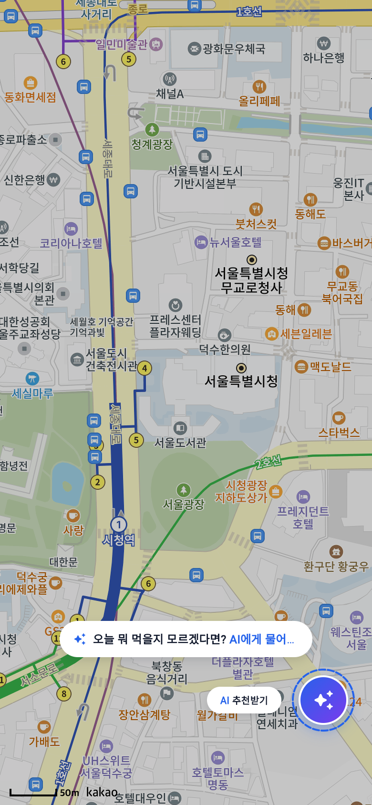
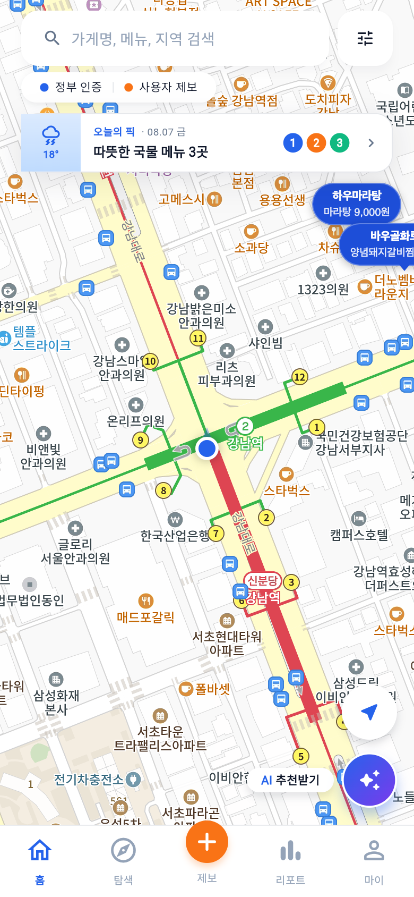
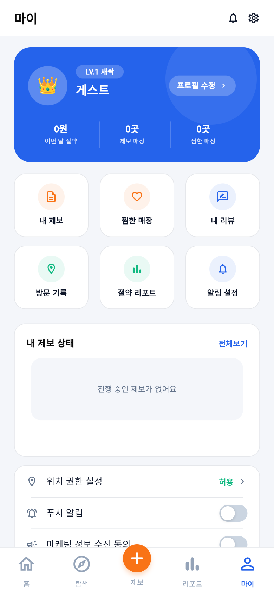

<div align="center">
  

  # 얼마고? (HowMuch)

  **공공데이터 + 사용자 제보로 만드는 동네 가성비 지도**

  착한가격업소 11,207곳과 사용자 제보 매장을 한 지도에서 탐색하고,
  방문 인증으로 참가격 대비 절약 금액까지 기록하는 모바일 중심 서비스입니다.

  <p>
    
    
    
    
    
    
  </p>

  [**🌐 웹 데모**](https://howmuch-zeta.vercel.app) ·
  [**🛠 어드민 페이지**](https://howmuch-zeta.vercel.app/admin.html) ·
  [**⚙️ API 서버**](https://howmuch-backend-1xnu.onrender.com)
</div>

---

## 📱 서비스 소개

`얼마고?`는 행정안전부 착한가격업소 공공데이터와 사용자들의 실시간 가격 제보를 결합한 동네 가성비 매장 탐색 플랫폼입니다. 지도에서 주변 매장을 찾고, 리뷰와 제보로 가격 정보를 함께 보완하며, 방문 인증을 통해 실제로 아낀 금액을 기록·시각화합니다.

졸업작품 팀 프로젝트 (4인) · 개발 기간: 2026.07 ~ 진행 중

## ✨ 주요 기능

| 기능 | 설명 |
| --- | --- |
| 🗺️ **가성비 지도** | 착한가격업소 11,207곳 공공데이터 + 카카오맵. 보이는 영역(bounds) 기반 동적 로딩, GPS 현위치 |
| 🔍 **검색 · 필터** | 실시간 검색(search-as-you-type), 현위치 기반 거리순 정렬, 업종 필터 |
| 📝 **사용자 제보** | 가격 제보 등록 → 어드민 심사(승인/반려) → 지도 공개. 내 제보 상태 추적 |
| ⭐ **리뷰** | 매장별 리뷰 작성/조회, 평균 평점·개수 집계 |
| ❤️ **찜 · 절약 리포트** | 찜한 매장 관리, 방문 인증 시 참가격(한국소비자원) 대비 절약 금액 자동 계산, 월별 통계 대시보드 |
| 🌤️ **오늘의 픽** | 기상청 단기예보 연동 — 날씨·기온 기반 메뉴 추천 (비/눈 → 따뜻한 국물 등) |
| 🤖 **AI 추천** | Gemini 기반 AI 챗봇 + 오늘의 픽 매장 최적 동선 추천 |
| 👥 **커뮤니티 피드** | 승인된 제보의 피드/상세 조회 |
| 🛠️ **웹 어드민** | 제보 심사, 리뷰/회원/문의 관리 대시보드 (X-Admin-Key 인증) |

## 🛠 기술 스택

**Frontend** — Flutter 3.44.0 · Dart 3.12.0 · Riverpod · go_router · 카카오맵 (iOS/Android/Web)

**Backend** — Spring Boot 3.4.0 · Firestore · 세션 토큰 인증(HMAC-SHA256) · Render 배포

**External APIs** — 카카오 로그인/로컬 · Gemini AI · 기상청 단기예보 · 공공데이터포털 착한가격업소

## 🏗 아키텍처

```
Flutter 앱 (iOS / Android / Web)
        │  HTTPS + Bearer 세션 토큰
        ▼
Spring Boot API (Render) ──────────────┐
        │                              │
        ├─ Firestore (유저·제보·리뷰·찜·문의)
        ├─ 인메모리 캐시: 공공데이터 11,207건
        │    (부팅 시 스냅샷 로드 → 콜드스타트 Firestore 읽기 0)
        ├─ 카카오 (로그인 검증 · 지도 · 주소 변환)
        ├─ Gemini (AI 챗봇 · 루트 추천)
        └─ 기상청 단기예보 (오늘의 픽)
```

- **Firestore 쿼터 보호**: 공공데이터는 classpath 스냅샷 + 인메모리 캐시로 서빙하고, 갱신은 24시간 가드 + Firestore 메타 문서로 재시작에도 유지
- **인증**: 카카오 토큰을 백엔드가 `/v2/user/me`로 직접 검증 → 자체 세션 토큰(168h) 발급, uid는 세션 attribute에서만 주입 (IDOR 방지)
- **어드민**: 앱과 분리된 웹 페이지, 상수 시간 비교 + 실패 지연으로 브루트포스 완화

## 📂 프로젝트 구조

```
howmuch/
├── lib/                    # Flutter 앱
│   ├── app/                # 라우터·테마
│   ├── core/               # 네트워크 클라이언트·상수
│   ├── features/           # 기능별 화면 (auth/home/store/community/...)
│   └── shared/widgets/     # 공통 위젯
├── howmuch_backend/        # Spring Boot API
│   └── src/main/java/com/howmuch/
│       ├── controller/     # REST 엔드포인트
│       ├── service/        # FirebaseService 등 비즈니스 로직
│       └── dto/            # 요청/응답 DTO
├── web/admin.html          # 어드민 웹 페이지
└── docs/                   # 프로젝트 문서
```

## 🚀 실행

```bash
# 앱 (백엔드는 Render에 상시 가동 중 — 로컬 백엔드 불필요)
flutter pub get
flutter run                # iOS/Android
flutter run -d chrome      # Web 미리보기
```

백엔드 로컬 실행이 필요한 경우(수정 테스트 등)는 [docs/TEAM_GUIDE.md](docs/TEAM_GUIDE.md)의 환경 설정 주의사항을 참조하세요.

## 📸 스크린샷

<p>
  
  
  
</p>

<sub>홈 지도(카카오맵 + 가격 마커) · 탐색(검색 + 정부 인증/사용자 제보 배지 + 오늘의 픽) · 마이페이지(이번 달 절약 · 제보/찜 현황)</sub>

## 👥 팀

| 이름 | 역할 | 담당 |
| --- | --- | --- |
| 김민서 | PM · Front-End | 온보딩, 홈 지도, 검색, 매장 상세, 마이페이지, 어드민, 공통 화면 |
| 김다나 | Front-End | 리뷰, 방문 인증, 가격 이력, 커뮤니티·절약 화면 연동 |
| 오태관 | Front-End | 제보, 커뮤니티, 절약 리포트, 추천, AI 챗봇, 찜 연동 |
| 박지환 | Back-End | API, DB, 인증, 공공데이터 연동, 어드민 데이터 |

## 📄 문서

- [PROJECT_STATUS.md](docs/PROJECT_STATUS.md) — 현재 진행 상황·핸드오프 (단일 기준 문서)
- [WEEKLY_PLAN.md](docs/WEEKLY_PLAN.md) — 주차별 계획
- [TEAM_GUIDE.md](docs/TEAM_GUIDE.md) — 팀 협업·AI 작업 가이드
- [ROLE_ASSIGNMENT.md](docs/ROLE_ASSIGNMENT.md) — 화면별 역할 분담
- [BRANCH_STRATEGY.md](docs/BRANCH_STRATEGY.md) — 브랜치 전략
- [FILE_STRUCTURE.md](docs/FILE_STRUCTURE.md) — 파일 구조 상세
